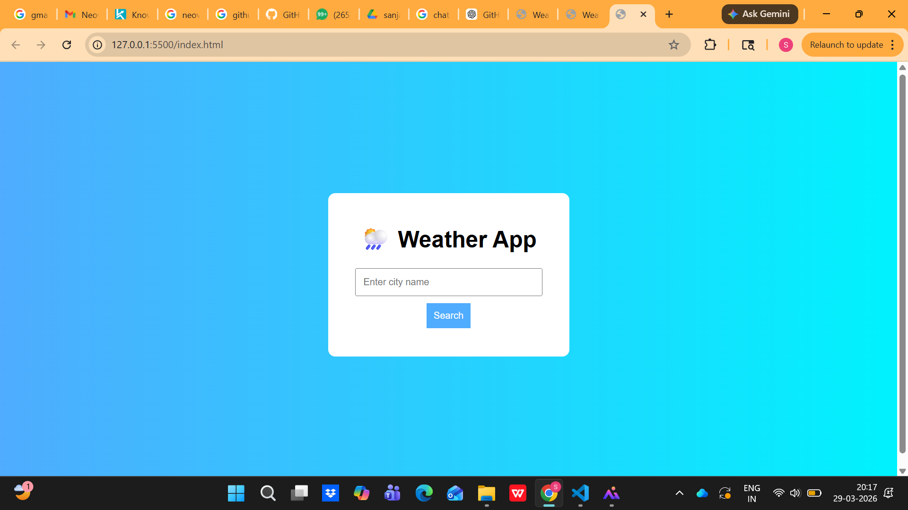

# 🌦️ Weather App

A lightweight web application that allows users to check real-time weather information for any city. The app fetches live data from a public weather API and displays key details in a clean user interface.

## 🚀 Features
- Search weather by city name
- Displays temperature, weather condition, humidity, and wind speed
- Handles invalid city inputs gracefully
- Simple and responsive design

## 🛠️ Tech Stack
- HTML5
- CSS3
- JavaScript (ES6)
- REST API (Weather Data)

## 📌 How It Works
The application takes a city name as input, sends a request to a weather API, and dynamically updates the UI with the retrieved data.

## ▶️ How to Run Locally
1. Download or clone this repository
2. Open the project folder
3. Run `index.html` in any web browser
4. Enter a city name to view weather details

## 📷 Output

## 🌐 Live Demo
https://sanjanaweatherapp.netlify.app/

---